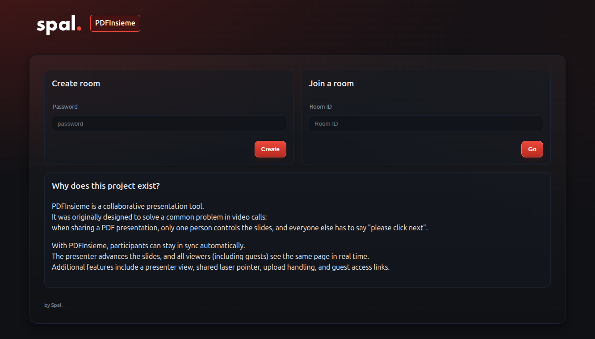
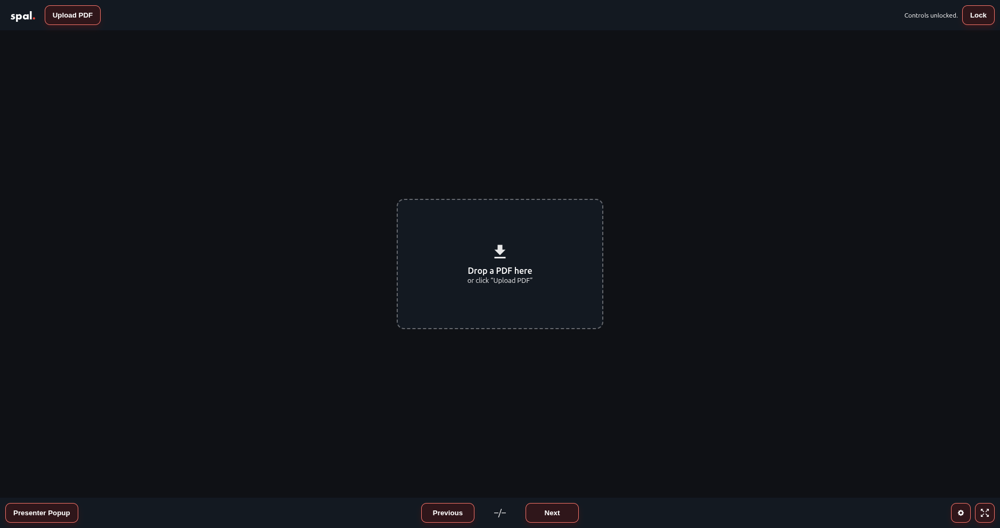

 


# PDFInsieme

PDFInsieme is a collaborative presentation tool.  
It was originally designed to solve a common problem in video calls:  
when sharing a PDF presentation, only one person controls the slides, and everyone else has to say *“please click next”*.  

With PDFInsieme, participants can stay in sync automatically.  
The presenter advances the slides, and all viewers (including guests) see the same page in real time.  
Additional features include a presenter view, shared laser pointer, upload handling, and guest access links.  

---



---

## Configuration

Configuration is handled via environment variables.  
Only the following variables need to be set:

- `SECRET_KEY`  
  A secret key for Flask session security.  
  Example: `changeme-in-production`

- `MAX_CONTENT_MB`  
  Maximum allowed upload size for PDF files (in megabytes).  
  Example: `64` (for 64 MB)

See `.env.example` for a template.

---

## Development

1. Clone the repository.
2. Create a `.env` file based on `.env.example`.
3. Run the server:

```bash
python app.py
```

The app will start and be available at [http://localhost:14341](http://localhost:14341).

---

## Docker Compose

Here is an example `docker-compose.yml` setup:

```yaml
services:
  web:
    image: spaleks/pdfinsieme:latest
    container_name: pdfinsieme
    volumes:
      - ./.env:/app/.env:ro
      - ./volumes/data:/app/data
```

- The `.env` file contains your configuration.
- `./volumes/data` persists uploaded PDFs and room data.

---

## License

MIT
